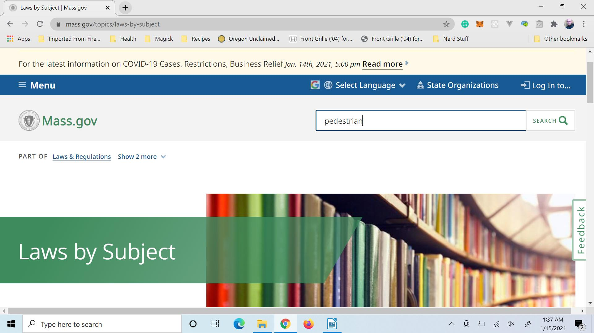

# Research

After brainstorming it is time to go to the actual law books of the body for which you are writing legislation. These are online and can be found by searching the name of the jurisdiction and ‘statutes’ or ‘laws.’ As previously stated, we will be using Massachusetts as the primary example. Ensure that you find authoritative government laws. Usually the address will end with .gov or .co or .us.

Perform a search of the laws using wording identical to that of your legislative topic. Check to make sure that something identical or very similar is not already enacted in law. Perhaps you will find a piece that only needs a few minor revisions to fulfill your idea or the project requirements. Work smarter, not harder. It is easier to draft signature-ready legislation by adding some sentences to laws already on the books. It could also be that nothing remotely close to your proposal exists and the bill must be drafted from the ground up.

Below a figure shows a search for the term ‘pedestrian’ on the [Massachusetts State Law website](https://www.mass.gov/topics/laws-by-subject). The depth of your search depends on your level of motivation. For complex matters, this is the time that you could collect a list of related laws and statutes.

Sometimes legislation gets written because another jurisdiction has written some laws that are innovative. This is an example of a time that you would want to explicitly expand your search to include outside legislative bodies, potentially even foreign.

 Do your due diligence and make sure you have found enough information about your issue as it relates to the law books so as not to be caught off guard. That will look different for every situation and is dictated by how comfortable you feel with your familiarity of the matter.

 Pre-writing research is where you will find an example of a bill or law for the jurisdiction so that you can make a template. The pedestrian search in Massachusetts laws yielded:

There are regulations and general laws. Regulations are rules that are written and enforced by a bureaucracy such as OSHA or the Unemployment Department. Regulations are written as a result of what is spelled out in general laws and statutes. Pay attention to words like laws, statutes, revised statutes, etc. Avoid regulations, codes, rules, and administrative rules for the purposes of making a template.

